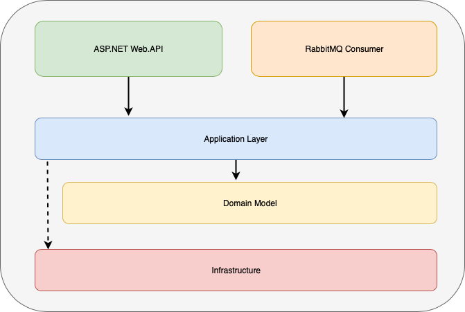

# Backend Assignment Course Sign-up

## Execution

The docker-compose.yml file creates the structure to run the application.

It creates three containers:

* **course-api:** REST API capable of sign-up students to a course or publish messages to the message broker to do the sign-up asynchronously.
* **course-consumer:** Service that listens the queue and do the sign-up asynchronously.
* **course-message-bus:** Container of the RabbitMQ.

## Progress

* Created an endpoint to sign-up students synchronously;
* Created an endpoint to enqueue a sign-up requests to a message bus;
* Created a consumer to process sign-up requests;
* The persistence is not implemented;
* The email after the asynchronous sign-up is not implemented.

## Technologies

* .Net Core
    * Provides better compatibility with docker containers (Linux).
    
* MongoDB (Not implemented)
    * Better scalability than SQL databases
    * Works better with eventual consistence scenarios
    * In cloud scenario, I probably would use a service like CosmosDB.

* RabbitMQ
    * Works with AMQP open standard
    * Works fine and scale well in containers
    * In cloud scenarios, I probably would use a service like Azure Service Bus.

* Moq
    * Provides an easy way to mock your dependencies and test the behavior.

* FluentAssertions
    * Make the tests assertions easier to read.

## Improvements

* I decided to do the logs and exception handling on the top layers (API and consumer):
    * I would implement as a middleware or injecting decorators into the dependency injection

* Use specific exceptions to make any business errors easier to identify;

* Create a correlation id for asynchrounous operations;

* The infrastructure project contains more then one concern, handling both persistence and messages. I would separate in to projects in two.

* Move the configurations (RabbitMQ, database) to a file or, in some scenarios, to a configuration server.

* Move the dependencies configuration to the application layer. This way, I prevent explicit references of the infrastructure component on top layers. 

## Proposed Design

###
